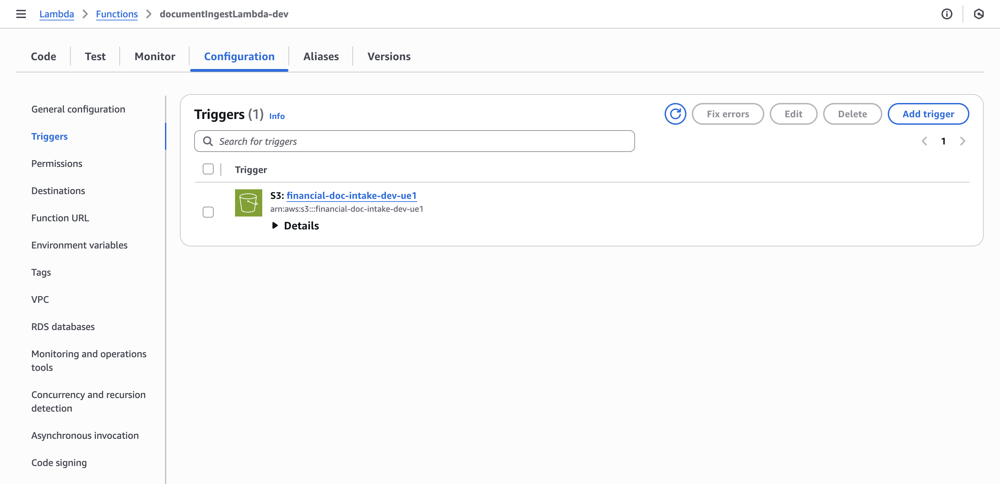
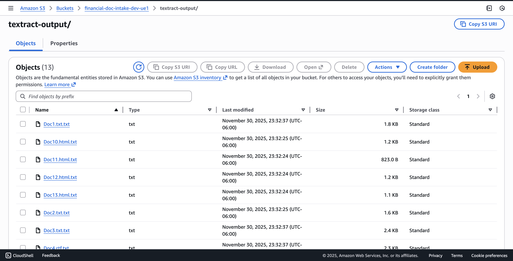
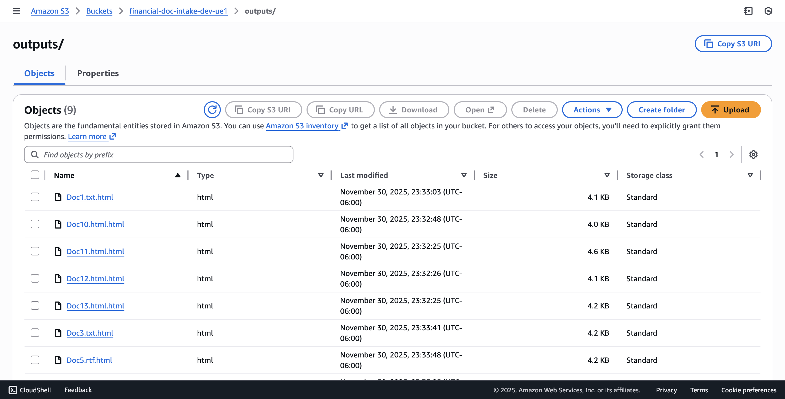
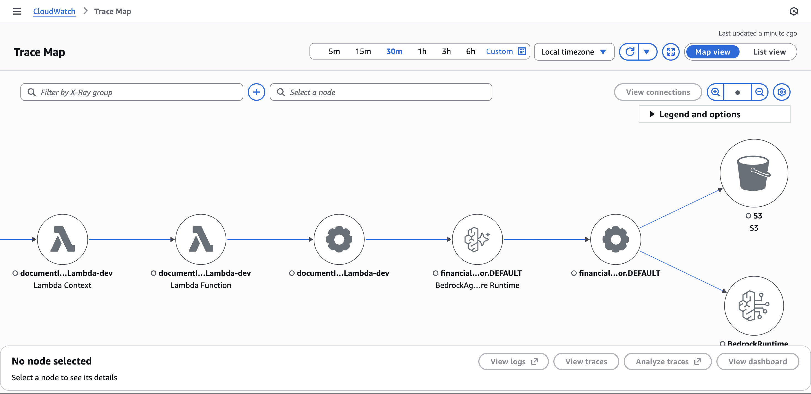

# Event-Driven Financial Document Intelligence on AWS Bedrock AgentCore

This project implements an **end-to-end, serverless GenAI pipeline** for financial documents using **Amazon Bedrock AgentCore**, **AWS Lambda**, **Amazon Textract**, **Amazon S3**, and **CloudWatch GenAI Observability**.

Whenever a new document (KYC form, advisory memo, suitability document, etc.) is uploaded to an S3 intake bucket, a **single Bedrock Supervisor agent** is invoked. The agent:

1. Detects file type and ingests the content.
2. Uses **Amazon Textract as a tool** for PDFs.
3. Classifies the document intent.
4. Generates a **human-readable intelligence report** (HTML).
5. Persists normalized text + final report back to S3.
6. Emits traces and metrics into CloudWatch for full observability.

---

## 1. High-Level Architecture


<!-- Architecture.jpg -->

**Key components**

- **Amazon S3**
  - `intake/` – raw documents uploaded by users or upstream systems.
  - `textract-output/` – normalized text extracted from original documents.
  - `outputs/` – final HTML “Document Intelligence Reports”.

- **AWS Lambda – `documentIngestLambda-dev`**
  - S3 event handler for `ObjectCreated` events on the `intake/` prefix.
  - Calls the Bedrock AgentCore runtime with `{ bucket, key }` payload.

- **Amazon Bedrock AgentCore – `financial_doc_supervisor`**
  - Single **Supervisor agent** that orchestrates the full workflow.
  - Uses an **AgentCore tool** that calls Amazon Textract for PDFs.
  - For non-PDFs (RTF, TXT, HTML, etc.) it reads from S3 directly.
  - Performs:
    - Document understanding.
    - Intent classification (e.g., `KYC_DOC`, `SUMMARY_MEMO`, etc.).
    - Extraction of key entities and action items.
    - Generation of the final HTML report.

- **Amazon Textract (tool)**
  - Invoked by the Supervisor only when the input is a PDF.
  - Outputs structured/normalized text into `textract-output/`.

- **Amazon ECR**
  - Hosts the container image for the AgentCore runtime.

- **Amazon CloudWatch + GenAI Observability**
  - Centralized logs for Lambda and AgentCore.
  - End-to-end traces across S3 → Lambda → AgentCore → Textract → S3.
  - Latency and error metrics per span (S3, model calls, AgentCore).

---

## 2. End-to-End Flow

1. A document is uploaded to the S3 intake folder:

   ```text
   s3://financial-doc-intake-dev-ue1/intake/<file-name>
2. S3 raises an ObjectCreated event that triggers documentIngestLambda-dev.
3. Lambda sends a request to the AgentCore runtime with payload:
   {
  "bucket": "financial-doc-intake-dev-ue1",
  "key": "intake/<file-name>"
}
4. Inside financial_doc_supervisor:
   The agent inspects the key / content type.

   If PDF → calls the Textract tool to extract text, stores normalized text under textract-output/.

   If non-PDF (e.g., .rtf, .txt, .html) → reads the file directly from S3.

5. Using the extracted text, the Supervisor agent:

  Classifies the document intent (e.g., KYC_DOC, SUMMARY_MEMO).

  Extracts key entities and fields (client name, advisor, dates, amounts, etc.).

  Generates a Document Intelligence Report summarizing:

    Document overview.

    Core intent.

    Key insights & action items.

    Automated outcome. 

6. The agent writes:

    Normalized text → textract-output/…

    Final HTML report → outputs/<original-file-name>.html

7. All calls are traced via CloudWatch GenAI Observability, giving span-level metrics for S3, Textract, AgentCore, and the underlying Bedrock model.


## 3. AWS Screenshots
3.1 AgentCore Runtime: highlight financial_doc_supervisor as the active agent -->


Shows the financial_doc_supervisor AgentCore runtime used by this pipeline.

3.2 Event-Driven Lambda + S3 Notifications

Lambda trigger from S3:



S3 bucket event notification on intake/:


3.3 S3 Layout & Outputs

S3 folder structure:


Textract / normalized text output:



Final HTML intelligence reports:


4. Sample Input vs. Intelligence Report

Raw KYC RTF document:


Generated Document Intelligence Report:


The report includes:

High-level understanding of the document.

Detected internal category (e.g., KYC_DOC, SUMMARY_MEMO).

Key insights and extracted fields.

Clear automated outcome text for advisors.

5. Observability & Tracing

Trace map for the full path (S3 → Lambda → AgentCore → S3 / Model):



AgentCore observability overview (sessions, traces, error rate):


Span-level latency & model metrics (S3, AgentCore, model calls):


These views confirm:

End-to-end latency per document.

Breakdown of time spent in:

Textract (when used).

Bedrock model calls.

S3 get/put operations.

Error-free operation across multiple sessions.

6. Technology Stack

AWS Services

Amazon Bedrock AgentCore

Amazon Textract (tool invoked from AgentCore)

Amazon S3

AWS Lambda

Amazon ECR

Amazon CloudWatch + GenAI Observability

Runtime & Code

Node.js Lambda for S3 event ingestion and runtime invocation.

Containerized AgentCore app (Python/Node, depending on your image) pushed to ECR.
